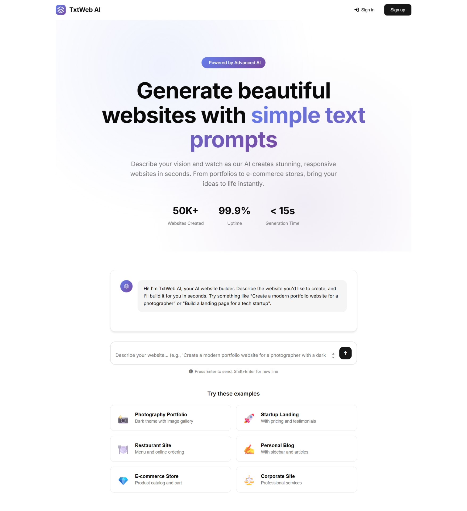

# TxtWeb AI - Generate Websites from Text Prompts

TxtWeb AI is an advanced web application that enables users to generate beautiful, responsive websites simply by describing them in natural language. Powered by AI, it transforms text prompts into functional HTML/CSS code in seconds.



## ✨ Features

- **AI-Powered Website Generation**: Create complete websites from simple text descriptions
- **Real-time Preview**: View your generated website instantly with device responsiveness testing
- **Project Management**: Save, edit, and manage all your website projects
- **User Authentication**: Secure account system with email and Google sign-in options
- **Database Storage**: Cloud-based storage of all your website projects
- **Example Templates**: Pre-configured prompts for common website types

## 🛠️ Tech Stack

- **Frontend**: HTML5, CSS3, JavaScript
- **Backend**: Python, Flask
- **Database**: Firebase Firestore
- **Authentication**: Firebase Authentication
- **Deployment**: Gunicorn WSGI server

## 📋 Prerequisites

- Python 3.8 or higher
- Firebase account with Firestore and Authentication enabled
- Firebase service account credentials

## 🚀 Installation

1. **Clone the repository**
   ```
   git clone https://github.com/yourusername/txtweb-ai.git
   cd txtweb-ai
   ```

2. **Install dependencies**
   ```
   pip install -r requirements.txt
   ```

3. **Set up Firebase credentials**
   - Create a `firebase-credentials.json` file in the project root
   - Add your Firebase service account key

4. **Environment variables**
   - Create a `.env` file in the project root
   - Add required environment variables:
     ```
     FLASK_SECRET_KEY=your_secret_key
     AI_API_KEY=your_ai_service_key
     ```

5. **Run the application**
   ```
   python app.py
   ```

6. **Open in browser**
   - Navigate to `http://localhost:5000`

## 💻 Usage

### Creating a Website

1. Sign up or log in to your account
2. Enter a description of your desired website in the prompt field
   - Example: "Create a modern portfolio website for a photographer with a dark theme and image gallery"
3. Click "Generate" or press Enter
4. Wait for the AI to generate your website (typically under 15 seconds)
5. Preview your website in desktop, tablet, or mobile view
6. Download the HTML file or save the project to your dashboard

### Managing Projects

1. Navigate to the Dashboard
2. View all your saved projects
3. Click on any project to:
   - Preview the website
   - Download the HTML
   - Edit or delete the project

## 🗂️ Project Structure

```
txtweb-ai/
├── app.py                  # Main Flask application
├── requirements.txt        # Python dependencies
├── firebase_manager.py     # Firebase integration
├── static/
│   ├── css/                # Stylesheets
│   │   ├── style.css       # Main site styles
│   │   ├── auth.css        # Authentication page styles
│   │   └── dashboard.css   # Dashboard styles
│   └── js/                 # JavaScript files
│       ├── main.js         # Main site functionality
│       ├── auth.js         # Authentication scripts
│       └── dashboard.js    # Dashboard scripts
└── templates/
    ├── index.html          # Homepage
    ├── auth.html           # Authentication page
    └── dashboard.html      # Dashboard page
```

## 🔧 Database Structure

```
Firebase Firestore/
├── users/
│   └── {user_id}/
│       ├── name
│       ├── email
│       ├── createdAt
│       └── settings/
│           ├── emailNotifications
│           ├── darkMode
│           ├── autoSave
│           └── defaultPrivacy
└── projects/
    └── {project_id}/
        ├── user_id
        ├── title
        ├── prompt
        ├── code
        ├── created_at
        ├── updated_at
        ├── tags
        └── is_public
```

## 📝 License

This project is licensed under the MIT License - see the LICENSE file for details.

## 👥 Contributors

- Your Name (@yourusername)

## 🙏 Acknowledgements

- Built with [Flask](https://flask.palletsprojects.com/)
- Authentication by [Firebase](https://firebase.google.com/)
- Icons from [Font Awesome](https://fontawesome.com/)

---

Made with ❤️ by Soham
